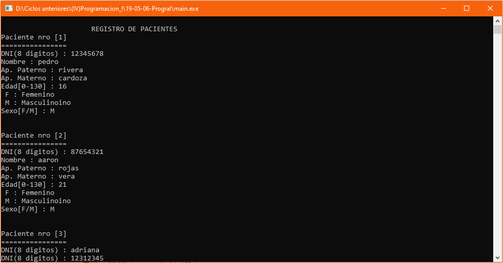
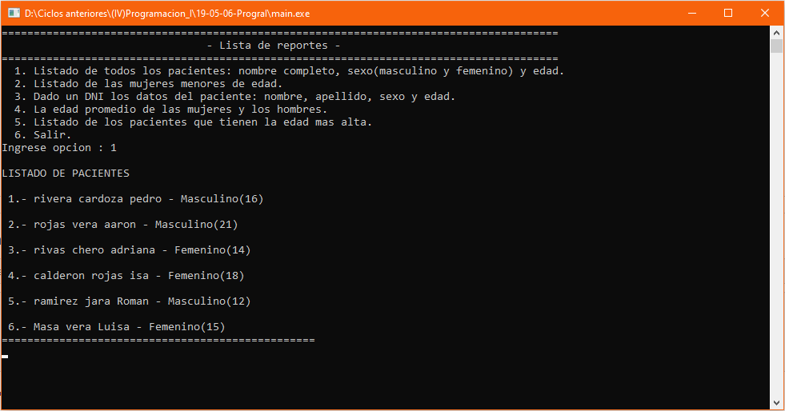

# Control de pacientes
Sistema de control de pacientes de una hospital que permite ingresar los datos de una cantidad definida de pacientes, mostrar los pacientes, mostrar las mujeres menores de edad, mostrar un paciente dado su DNI, mostrar la edad promedio de mujeres y hombres, mostrar un listado con los pacientes que tengan la edad más alta, **06/05/19**.

<strong>Imagen:</strong> Inicio del sistema.

<strong>Imagen:</strong> Menú de reportes.

